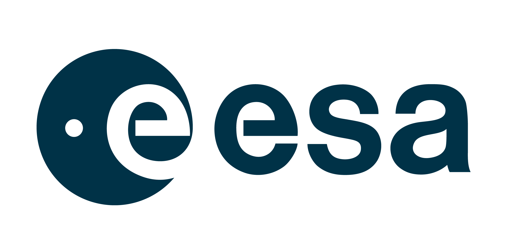
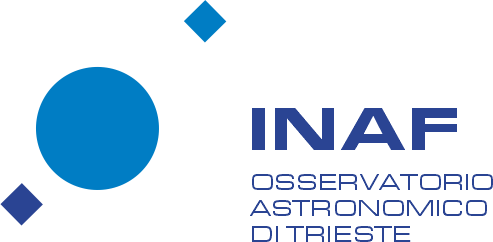
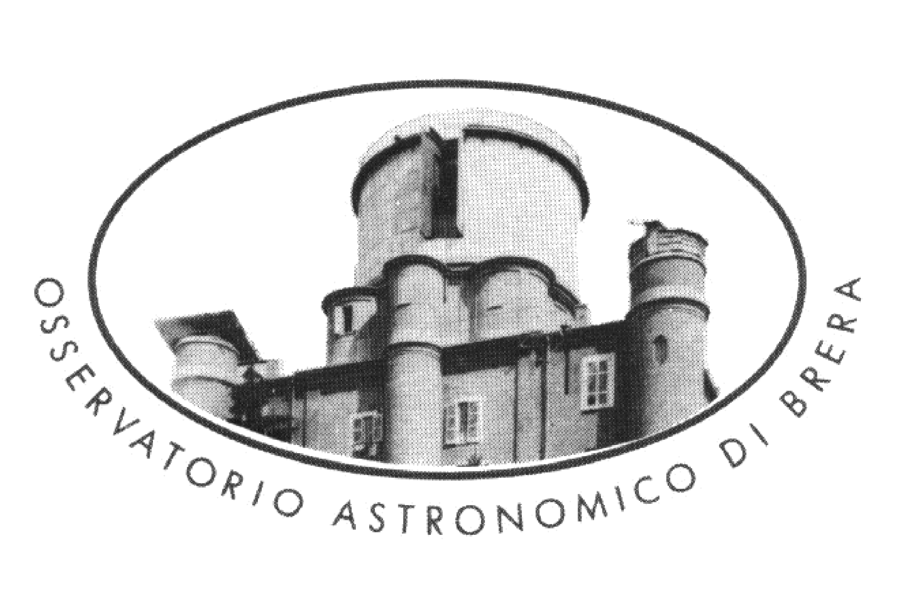

# cloe-org

 

Welcome to the *cloe-org* GitHub organization — your hub for cosmological modeling and statistical inference focused on large-scale structure.

We are a group of cosmologists, primarily members of the Euclid Consortium and other large-scale structure collaborations, dedicated to advancing cosmological statistical inference. Our main focus is on developing open-source software that enables the comparison of theoretical models with diverse cosmological datasets to derive robust statistical constraints. While our work is strongly motivated by the scientific goals of the Euclid mission, our tools and methods are designed to be broadly applicable across current and future cosmological experiments.

Our team previously contributed to the development of **CLOE** (Cosmology Likelihood for Observables in Euclid). Building on the expertise gained from that experience, we are now developing a new generation of CLOE-inspired software aimed at maximizing the scientific return of upcoming cosmological surveys. Our goal is to facilitate a seamless interface between theoretical predictions and data analysis, fostering accessibility and collaboration within the broader cosmology community.

**Current list of cloe-org maintainers** include (in alphabetical order):

- [Dr. G. Cañas-Herrera](https://github.com/gcanasherrera)
- [Dr. P. Carrilho](https://github.com/PedroCarrilho)
- [Dr. S. Casas](https://github.com/santiagocasas)
- [Dr. M. Bonici](https://github.com/marcobonici)
- [Dr. C. Moretti](https://github.com/chiaramoretti)
- [Dr. A. Pezzotta](https://github.com/AndreaPezzotta)

## 📂 Repositories

Our main repositories:

| Repository Name | Description |
|-----------------|-------------|
| [cloelib](https://github.com/cloe-org/cloelib) | Computation of the theoretical predictions for Euclid primary observables |
| [cloelike](https://github.com/cloe-org/cloelike) | Euclid likelihood module for photometric and spectroscopic primary observables |
| [playground](https://github.com/cloe-org/playground) | Tutorials, examples and DEMO notebooks |
| [darkflipper](https://github.com/cloe-org/darkflipper) | Computation of Figure of Merit and Figure of Bias measurements |

You can browse all our repositories [here](https://github.com/orgs/cloe-org/repositories).

## 💡 How to Get Involved

We welcome contributions from everyone! If you're interested in collaborating or contributing, here's how you can get started:

1. **Explore our repositories** – Check out the codebases and documentation.
2. **Open an issue** – Found a bug, have a feature request, or need help? Open an issue in the respective repository.
3. **Submit a pull request (PR)** – Contribute code, documentation, or improvements. Please follow the contribution guidelines provided in each repo.
4. **Join discussions** – Engage with us in [Discussions](https://github.com/orgs/cloe-org/discussions) or raise questions in issues.

## ⚖️ Code of Conduct Compliance

All members, contributors, and maintainers of the cloe-org organization are required to adhere to our [Code of Conduct](https://github.com/cloe-org/.github/blob/1-include-code-of-conduct-in-readme/conduct/CODE_OF_CONDUCT.md).

By participating in any of our projects, discussions, or events—whether online or offline—you agree to uphold the principles of respect, inclusion, and professionalism outlined in the Code of Conduct.

This commitment ensures a safe, welcoming, and productive environment for everyone in our community, regardless of background, experience level, or identity.

Failure to comply with the Code of Conduct may result in corrective actions as described in the document, including but not limited to warnings, temporary bans, or removal from the community.

## 🤝 Contribution Guidelines

Each repository may have its own specific contribution guidelines, but you can find general principles [here](https://github.com/cloe-org/.github/tree/main/colprac).

The `cloelib`, `cloelike` and `playground` repositories follow the [All Contributors](https://allcontributors.org/) approach to recognize all types of contributions.

You can find the list of contributors in the README files of each repository. This helps us acknowledge everyone who contributes, whether through code, documentation, bug reports, or other support.

## 💬 Communication

- **Issues** – The best place to ask technical questions or report bugs for each project.
- **Discussions** – Use GitHub Discussions for broader conversations and brainstorming.
- **Contact us** – For general inquiries, you can reach any of the **cloe-org** maintainers by tagging @cloe-org/cloe-maintainers in any issue/discussion.

## 📜 Licensing

All our projects are licensed under MIT unless stated otherwise. Check the individual repository's license for more details.

## ⭐ Supporting Partners  

The development of **cloe-org** software is proudly powered by the support of all around the world research institutions and collaborations.

- [Dr. G. Cañas-Herrera](https://gcanasherrera.com) acknowledges support through the [European Space Agency research fellowship programme](https://www.cosmos.esa.int/web/space-science-faculty/opportunities/research-fellowships).

  
  &nbsp;&nbsp;&nbsp;&nbsp;
  
  &nbsp;&nbsp;&nbsp;&nbsp;
  
  &nbsp;&nbsp;&nbsp;&nbsp;
  
  &nbsp;&nbsp;&nbsp;&nbsp;
  
  &nbsp;&nbsp;&nbsp;&nbsp;
  
  &nbsp;&nbsp;&nbsp;&nbsp;
  
  &nbsp;&nbsp;&nbsp;&nbsp;
  

*(Logos © belong to their respective institutions)* 

---

✨ **Love our work? Here’s how you can help keep it growing:**  
- 🌟 **Star** our repositories  
- 💬 **Spread the word** in your network  
- 🚀 **Contribute** with code, ideas, or collaborations  
- 📖 **Use & cite** our software in your research  

